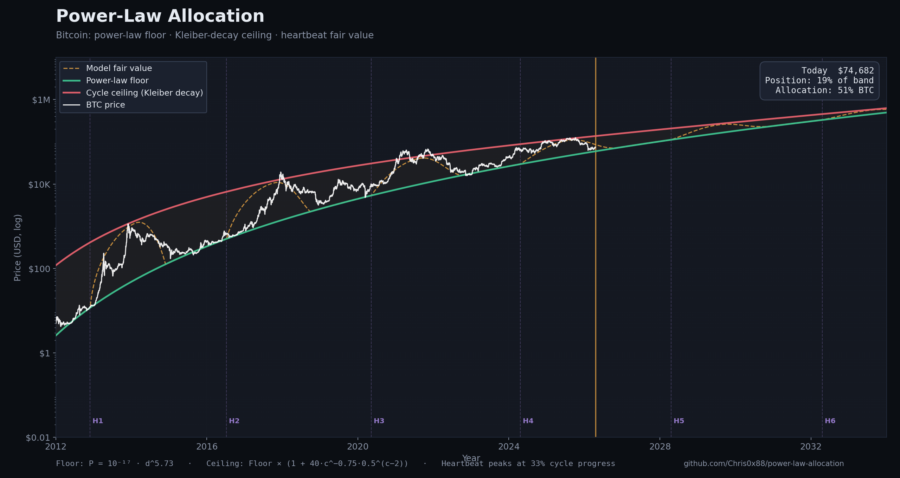

# Power-Law Allocation

**A deterministic, transparent framework for Bitcoin portfolio allocation.**

Given just a date and today's BTC price, this model tells you what percentage
of a portfolio "should" be in Bitcoin. No database. No historical feed. No
machine learning. Just a power law, Kleiber's Law, and a heartbeat.

This repo is the canonical, app-independent home of the research, the math,
the code, and the rationale. It is designed to be adopted by any application,
bot, or research environment.

---

## The Model in 30 Seconds

Three references, calculated deterministically from the date alone:

```
FLOOR   = 10^(-17) × days_since_genesis^5.73     ← Power-law equilibrium (~40%/yr growth)
CEILING = FLOOR × Spike(cycle)                    ← Speculative peak envelope (Kleiber decay)
MODEL   = FLOOR + (CEILING - FLOOR) × Heartbeat   ← Where price "should" be in this cycle
```

Price lives somewhere between floor and ceiling. The **position in band** plus
the **phase of the halving cycle** determine your allocation:

- Near the floor → buy aggressively
- Near the ceiling → protect capital
- In the post-peak cooldown zone → don't catch falling knives

**Historical finding** (2014–2026 backtest): a 22% rebalance threshold
converts this signal into **2.55× vs HODL** with just ~8 trades per year.

### The one principle that matters

> **Loose rebalancing is the profit driver.**
> ~8 trades a year beats HODL. 1,000 trades a year loses to HODL.

The strategy works because it trades rarely, absorbs big chunks of value
during each cycle, and leaves the position alone in between. Every tighter
threshold that has been backtested — 1%, 5%, 10%, 15% — produces *worse*
returns, because fees, slippage, and tax drag eat the edge faster than
noise-chasing can generate it. See [docs/REBALANCER.md](docs/REBALANCER.md).

See **[docs/MODEL.md](docs/MODEL.md)** for the full math and
**[docs/THESIS.md](docs/THESIS.md)** for why this is worth doing.

---



## Interactive Chart

The static image above is generated by [scripts/generate_chart.py](scripts/generate_chart.py).
For a live, interactive version open **[chart/index.html](chart/index.html)**
in any browser — it fetches current BTC history, plots floor/ceiling/fair-value
against actual price, marks halvings, and shows today's allocation signal.

A narrower ±5-year zoom is available as
[chart/model_zoom.png](chart/model_zoom.png).

---

## Quick Start

```python
from datetime import datetime
from power_law import get_daily_signal

signal = get_daily_signal(datetime.now(), btc_price=95_000)
print(signal["allocation_pct"])  # e.g. 42.0
print(signal["tagline"])
# Cycle 5 | 28% through cycle | Pre Peak Build Up | Price at 35% of range
# (undervalued) | Favorable accumulation: 62% BTC
```

```python
from power_law.rebalancer import Rebalancer, RebalancerConfig, PaperVenue

venue = PaperVenue(btc=0.0, usd=10_000, _price=95_000)
r = Rebalancer(venue, RebalancerConfig(threshold_pct=0.22))
r.tick()  # call on a schedule
```

Run the full example:

```bash
pip install -r requirements.txt
python examples/quickstart.py
```

---

## Repo Map

```
power-law-allocation/
├── README.md                ← You are here
├── LICENSE                  ← MIT
├── requirements.txt         ← numpy, pandas
│
├── docs/
│   ├── THESIS.md            ← Why this model — the investing philosophy
│   ├── MODEL.md             ← Full math: floor, ceiling, heartbeat, allocation
│   ├── REBALANCER.md        ← Rebalancing policy, threshold research, tradeoffs
│   ├── VENUES.md            ← Where to execute: why we like SaucerSwap, and the LP angle
│   ├── BACKTEST.md          ← Results: 2014–2026, fee sensitivity, walk-forward
│   └── CONSTANTS.md         ← The locked calibration — what each constant means
│
├── src/power_law/
│   ├── model.py             ← THE CORE MODEL — 400 lines, stateless, no I/O
│   └── rebalancer.py        ← Venue-agnostic reference rebalancer + paper-trade venue
│
├── examples/
│   └── quickstart.py        ← End-to-end example (signal + projection + paper trade)
│
├── chart/
│   └── index.html           ← Interactive Plotly chart (open in any browser)
│
└── papers/
    └── (research papers in markdown and PDF)
```

---

## Primary API

```python
from power_law import (
    get_daily_signal,        # full signal dict for (date, price)
    allocation_signal,       # just the 0.0–1.0 allocation number
    floor_price,             # power-law floor at a date
    ceiling_price,           # cycle ceiling at a date
    model_price,             # fair-value midpoint
    position_score,          # 0 (floor) → 1 (ceiling) for a given price
    get_future_projections,  # 1M–36M forward view
    backtest,                # run the strategy on a DataFrame of prices
)
```

A single signal call returns everything a bot or UI needs:

```python
{
  "date": "2026-04-17",
  "price": 95000,
  "allocation_pct": 62.0,
  "floor": 48200,
  "ceiling": 285000,
  "model_price": 91400,
  "position_in_band_pct": 35,
  "cycle": 5,
  "cycle_progress_pct": 28,
  "phase": "pre_peak_build_up",
  "valuation": "undervalued",
  "stance": "accumulate",
  "tagline": "Cycle 5 | 28% through cycle | ..."
}
```

---

## Design Principles

1. **Deterministic.** Same date + price → same signal. No random seeds, no drift.
2. **Stateless.** No databases, no warm-up period. Works in a Lambda, a
   notebook, a phone.
3. **Transparent.** All constants and equations are public and documented.
4. **Venue-agnostic.** The model emits a target %. The rebalancer is an
   interface. Bind it to whatever execution venue you like.
5. **Locked calibration.** The five constants at the heart of the model
   are fixed. Tuning them defeats the point.

---

## How long this model lasts

The power-law framework assumes Bitcoin is still in its volatile, cycle-
dominated youth. It will not last forever.

Every mature asset class — gold, equities, sovereign debt — eventually
trades in an **exponential** growth regime, not a power-law one. Volatility
compresses. Cycles smooth out. Price becomes a function of money supply and
a modest real return.

We expect Bitcoin to make the same transition once it has absorbed a
critical mass of global wealth — acting as a slow anchoring system that
either recapitalises the USD or replaces it as a reserve. At that point,
the four-year halving rhythm stops mattering, the ceiling stops
constraining, and a constant 80–100% allocation becomes the right answer.

**Our horizon for this framework:**

- **5 years minimum** — through ~2030. Cycle 5 should behave like prior
  cycles, with visibly compressed amplitude consistent with Kleiber decay.
- **5–10 years** — cycle amplitude keeps compressing. The model still wins,
  by a smaller margin.
- **Beyond 10 years** — probabilistically the cycle structure breaks. A
  successor framework retires this one.

See **[docs/THESIS.md](docs/THESIS.md)** for the full expected-lifespan and
endgame analysis.

---

## Status

Research framework, v1.0. Public under MIT.

This is not financial advice. The model makes a claim about Bitcoin's
long-run structure; that claim may be wrong. See
[docs/THESIS.md](docs/THESIS.md) for the full list of failure modes.

— Chris Imgraben
